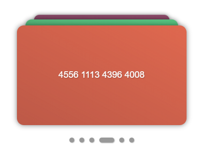

# Card-changer

Cards stack UI lib. No dependencies.

Check out [a live demo](https://avin.github.io/card-changer)

[](https://avin.github.io/card-changer)

## Usage

Install lib:

```sh
npm install card-changer
```

Make root container for card-changer:

```html
<div id="root"></div>
```

Init card-changer:

```js
import CardChanger from "card-changer";

const cardChanger = new CardChanger(document.querySelector("#root"), {
  cards: [
    {
      id: "card1",
      frontContent: "...", // HTML string or element with front card content
      backContent: "...", // HTML string or element with back card content
    },
    {
      id: "card2",
      frontContent: "...",
      backContent: "...",
    },
    // ...
  ],
  activeCardId: "card1",
  stackSize: 3,
  stackHeight: 40,
});

// Set active card
cardChanger.activeCardId = "card2";

// Rotate current card
cardChanger.rotate();

// Add handler on active card change
cardChanger.on("change", (activeCardId) => {
  console.log(`Active card id is "${activeCardId}"`);
});
```

## API

### Options

#### Option fields

| Field            | Type      | Description                                                                        |
| ---------------- | --------- | ---------------------------------------------------------------------------------- |
| stackSize        | `Number`  | Amount of visible cards in stack                                                   |
| stackHeight      | `Number`  | Height of back cards area                                                          |
| rootClassName    | `String`  | Root class name for all generated sub-elements                                     |
| dotsNavigation   | `Boolean` | Show dots navigation                                                               |
| keepChangeOrder  | `Boolean` | Cards change sequentially with animations for each                                 |
| animationSpeed   | `Number`  | Animation speed for change one card (should be the same as CSS animation duration) |
| cards            | `Array`   | Array with cards object (see [Card fields](#card-fields))                          |
| activeCardId     | `String`  | Card id that should be on top of the stack                                         |
| unRotateOnChange | `Boolean` | Rotate to front card when it becomes inactive                                      |

#### Card fields

| Field        | Type                      | Description                                  |
| ------------ | ------------------------- | -------------------------------------------- |
| id           | `String`                  | card unique ID string                        |
| frontContent | `String` or `HTMLElement` | HTML content with the front side of the card |
| backContent  | `String` or `HTMLElement` | HTML content with the back side of the card  |

### Methods

- `rotate ()` - rotate active card
- `on (event, handler)` - add handler for card-changer event
- `off (event, handler)` - remove handler for card-changer event

To set an active card id - assign it to `activeCardId` field:

```js
cardChanger.activeCardId = "new_id";
```

### Events

| Field  | Params       | Description                 |
| ------ | ------------ | --------------------------- |
| change | activeCardId | fires on active card change |

## Examples

Check out an example code [here](./demo/src/main.js)

## License

MIT
